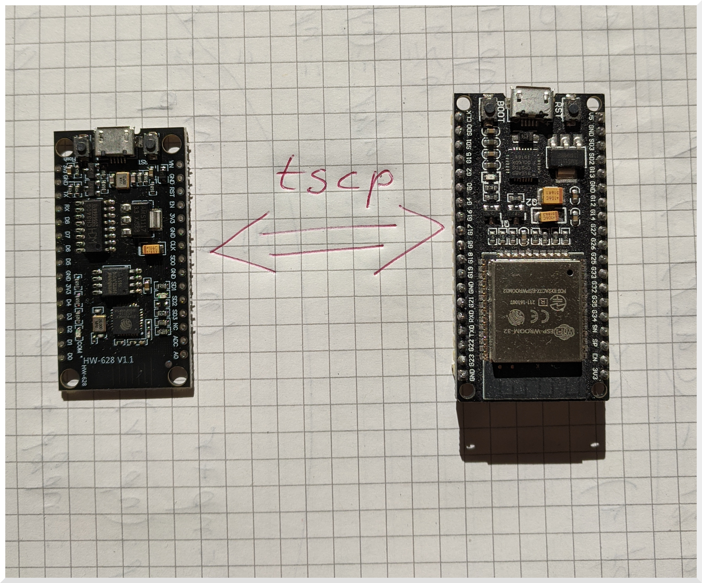

# tscp (tiny secure communication protocol)



An E2EE (endpoint-to-endpoint encryption) is possible to implement on resource constraint microcontrollers using a high-level programming language. A secure protocol based on a well-known key-exchange technique Diffie-Hellman-Merkle and TLS1.3 style session-key negotiation is implemented and tested. 

Large primes are not needed in the modified DHM key-exchange protocol pow(x,b)%P == pow(y,a)%P. MicroPython modules are developed to provide identification, authentication, and privacy of messages between two communicating end-points. The limiting factor of large integers arithmetic in Python is the amount of runtime time RAM available. An end-to-end is an application-level protocol and thus can be used for any form of message exchange.

This work entitled **Simple E2EE Secure Communication Protocol for Tiny IoT Devices** was submitted to **The 19th. International Conference on Cooperative Design, Visualization and Engineering - CDVE2022**. The proceedings book will be published by the Lecture Notes in Computer Science (LNCS).

## Testing (with debugging)

```python
MicroPython v1.19.1-358-g0b26efe73-kaki5 on 2022-09-02; ESP32 BLE (KAKI5) module with ESP32
>>> import test_tscp_aes_debug
0 ----------------------------------
This is the start of a beautiful day!
b'Hello:KAKI5-1-0-A:C-1-2-38:oXo|AES:102:116297090366876477071146'
b'Hey:AES:5b750788b9c20329015a0d0f41a060db05f708badfc048792c17770c01d6e142:27756140084870699242461'
b'5b750788b9c20329015a0d0f41a060dbfd8a61f66078db94502d0e51873a3468cf92f1012da188887d5780d1b0b372f9c7c49c34dc0a17f86ef052afafb0cf94:e12354abaf648620c8bf7bb96a023c0d0437be0e7b5336ba003106d1c360fe5f'
Bob:
   Client node authenticates? True C-1-2-38
   Server node authenticates? True S-9-12-10
   Data hash ok? True
SRV msg: b'188dc78a7f2707be008a3d33ce39417be0d4e71a6868d80e849768b8abe05da5aaa472a2ba34eb789431fa6ccf6fa3baff921a7c5b45b8cafbdea75c2fae2dfc:50b8f3efe52dfc7c0c139f64f24d1b31d8fdbde293d5ebd6175dbc98a9b4e06b'
Raw Data:188dc78a7f2707be008a3d33ce39417be0d4e71a6868d80e849768b8abe05da5aaa472a2ba34eb789431fa6ccf6fa3baff921a7c5b45b8cafbdea75c2fae2dfc
Hash: 50b8f3efe52dfc7c0c139f64f24d1b31d8fdbde293d5ebd6175dbc98a9b4e06b
SRV data: S-9-12-10:C-1-2-38:THIS IS THE START OF A BEAUTIFUL DAY!
It hash: b'50b8f3efe52dfc7c0c139f64f24d1b31d8fdbde293d5ebd6175dbc98a9b4e06b'
Alice:
   Client node authenticates? True C-1-2-38
   Server node authenticates? True S-9-12-10
   Data hash ok? True
THIS IS THE START OF A BEAUTIFUL DAY!
1 ----------------------------------
This is the start of a beautiful day!
b'Hello:KAKI5-1-0-A:C-9-6-11:oXo|AES:101:37324430542233743414781'
b'Hey:AES:d51b9827885fbdc7e9deea374a76428649c3af9d9a81b6f590fe01da64659bc7:64010375101150211120541'
b'd51b9827885fbdc7e9deea374a76428617bfaf94c4ddb5731422cb538006eb678133432938431da02756d476c9889bc1dc1125b3485626d5e0b9aa313b44c314:c589638603ed8a484d642f622fb0c5eea2c4febee2d2ed75e5a6dacda6b23d66'
Bob:
   Client node authenticates? True C-9-6-11
   Server node authenticates? True S-13-6-28
   Data hash ok? True
SRV msg: b'd173839522a4bb7236f8baf9ed85bbd2600600d5dcff141c80f32da8c0e8d4a04f6b01cc5cd2cc5b90d221cbb1a05712fa93c2c7195d8b70900228e170e48635:adbf841852fb500e03c5460e1b0865d97d830105869d60c94d7527e9958ab506'
Raw Data:d173839522a4bb7236f8baf9ed85bbd2600600d5dcff141c80f32da8c0e8d4a04f6b01cc5cd2cc5b90d221cbb1a05712fa93c2c7195d8b70900228e170e48635
Hash: adbf841852fb500e03c5460e1b0865d97d830105869d60c94d7527e9958ab506
SRV data: S-13-6-28:C-9-6-11:THIS IS THE START OF A BEAUTIFUL DAY!
It hash: b'adbf841852fb500e03c5460e1b0865d97d830105869d60c94d7527e9958ab506'
Alice:
   Client node authenticates? True C-9-6-11
   Server node authenticates? True S-13-6-28
   Data hash ok? True
THIS IS THE START OF A BEAUTIFUL DAY!
# error: 0 in 2 tests
>>> 
```

The tscp.py script was produced by pyminify. Please read tscp_debug.py and test_tscp_aes_debug.py for more information on how this module works.


